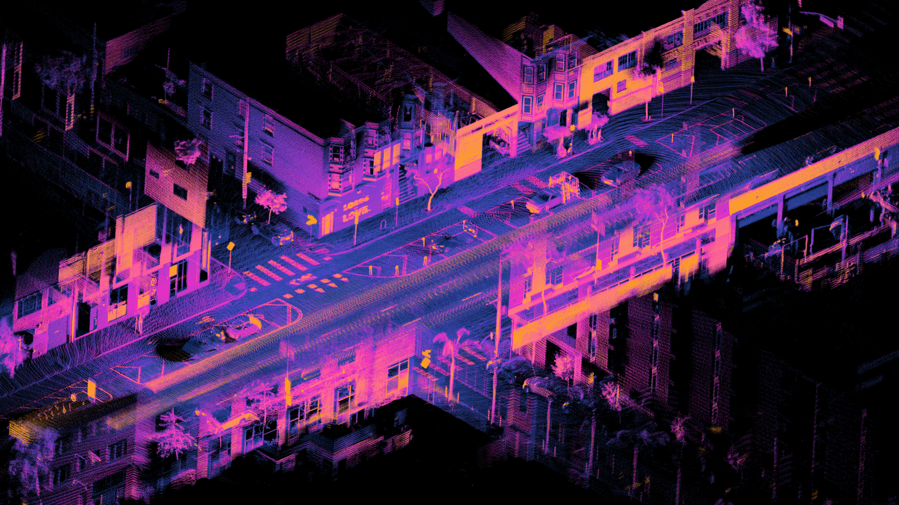
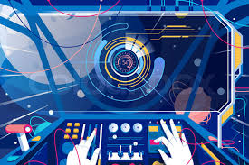

# Info351

# Please download the work file on : [Download](https://drive.google.com/file/d/1RQZBup_yby3tJpz7ID5Deb4OuE7IEJjr/view?usp=drive_link)

# Weekly Blog 

* [Week 4](#week_4sep5---sep18)
* [Week 3](#week_3aug22---sep4) 
* [week 2](#week_2aug7---aug21)
* [Week 1](#week_1jul10---aug6)

## WEEK_4(Sep/5 - Sep/18)
# Coming Weeks plan: 
### Must-Have: 
- Virtual Objects interaction: Create vertical button can be interacted with it.
- Texture feature apply
### Should-Have
- Actual Objects interaction
- skybox changes: environment changes by time (day and night)
## Could-Have: 
-  Indoor lighting 
-  Outdoor environment changes 
# Project Ongoing : 

### Must-Have: 
- 3D modeling (Done): This is considered essential and has been completed.
 
 
- Movement Tracking (Done): Another critical requirement that has been completed.
  
- Vertical Objects interaction (Ongoing): An important feature that's currently in progress.
- Skybox changes (Ongoing): Also ongoing and important for the project.
- Texture feature apply: This is considered essential and must been completed.
  
### Should-Have:
- Actual Objects interaction - Table alignments (Planning): This is important but not as critical as the "Must-Have" items. It's in the planning stage.
- Indoor lighting (Planning): Another "Should-Have" item that's in the planning stage.
- Outdoor environment changes (Ongoing): This should enhance the project but is not essential like the "Must-Have" items.

  
### Could-Have: 
- Background story: This is considered a nice-to-have feature but not essential to the core functionality.
- Make it a game: Also a desirable but optional feature.
### Won't-Have:
- Multi-player: Explicitly excluded from the project scope.

# Potential useful rescues:  
[Black Whale Studio - XR Tutorials](https://www.youtube.com/@blackwhalestudio)
 
[iHeartGameDev](https://www.youtube.com/@iHeartGameDev)
# Student lecture research: 
- Inertial Measuring Unit (IMU): IMU is an electronic device that measure and reports body's specific force, angular rate, and sometime the orientation of the body, using combination of accelerometers, gyroscopes and somite magnetometers.  

  
- Simultaneous localization and mapping(SLAM): SLAM is the computational problem of constructing or updating a map of an unknow enviroment while simultaneously keeping track of an angent's location wihtin it. 

  
- Outside-in motion capture for HMD’s: In outside-in systems multiple fixed external cameras are used to track the pose (3D position and 3D orientation) of the HMD. In particular, the external cameras track a set of reference points located on the headset and on the controllers (if any)

- Inside-out tracking for HMD's : Inside-Out tracking is a method of positional tracking commonly used in XR technologies, specifically for tracking the position of head-mounted displays (HMDs) and motion controller accessories.
  
# Source : 
[Inertial Measuring Unit](https://en.wikipedia.org/wiki/Inertial_measurement_unit) 
[Real-Time Motion Tracking for Mobile Augmented/Virtual Reality Using Adaptive Visual-Inertial Fusion](https://www.mdpi.com/1424-8220/17/5/1037) 
[ORB-SLAM3: An Accurate Open-Source Library for Visual, Visual–Inertial, and Multimap SLAM](https://ieeexplore.ieee.org/abstract/document/9440682) 
[Evaluation of the Oculus Rift S tracking system in room scale virtual reality](https://link.springer.com/article/10.1007/s10055-022-00637-3#:~:text=In%20outside%2Din%20systems%20multiple,the%20controllers%20(if%20any).) 
[Inside-out tracking](https://xrsi.org/definition/inside-out-tracking#:~:text=Inside%2DOut%20tracking%20is%20a,HMDs20and%20motion%20controller%20accessories.)

## WEEK_3(Aug/22 - Sep/4)

# What happened: 
Wu had some experience of 3D photogrammetry, which is transfer 2D image to 3D models. In order to make a 3D models we to take good image of the object we'd like to create 3D models, which should include basics  factory:
- Quality Camera: Utilize a high-quality camera with manual settings to capture fine details.

- Stability: Securely mount the camera on a stable platform to minimize vibrations and ensure sharp images.

- Lighting: Ensure even and diffused lighting to avoid harsh shadows or overexposed areas.

- Consistent Exposure: Keep exposure settings uniform throughout the entire photoshoot.

- Overlap: Aim for an overlap of approximately 25% to 50% between each photo. This provides enough common features for photogrammetry software to match and stitch images together.

- Fixed Perspective: Maintain a consistent height and angle for the camera throughout the capture process

## Student lecture prepare: 
Topic should include :  
- GPS: why we not using GPS in VR/AR systems
- Inertial Measuring Unit(IMU): what is IMU? why this IMU so important?
- Outside-in motion capture for HMD's: what is it? 
- inside-out tracking for HMDs: what is the different outside-int motion capture ?

## WEEK_2(Aug/7 - Aug/21)
# What Happened:
In the past two weeks, our lecture involved pairing up with fellow students to work on exciting projects. The pairs were as follows:
1. me and Mattias, we are aiming to create a space project.
2. Christine and Amelia teamed up to work on the Whack-a-mole project.
3. Andrew and Jet joined forces to tackle the Temple Run project.

During our discussions, we focused on conceptualizing our project. In the initial draft, we plan to incorporate a dashboard featuring various buttons at the top. Some of these buttons will serve functional purposes, allowing users or players to interact with the application, while others will be for navigation.

Regarding the room style, we've brainstormed several ideas and possibilities, including:
# possible dashboard:  
 - ## Minimalism: The control room style will emphasize simplicity and clean design, with a focus on essential functions and a clutter-free interface.
   <!--  -->
   
 - ## Maximalism: The control room style will embrace complexity and a wealth of buttons and features, creating a visually rich and intricate design.
   <!--  -->
    
 - ## Futurism: The control room style will embody a futuristic and avant-garde aesthetic, featuring sleek, high-tech designs, and innovative interface elements that convey a sense of forward-looking technology.
   <!--  -->
    

# Destination
 - ## Start(moon base) :      
- ## Mar :       
- ## Titan:      
- ## Saturn:     

# Plan: 
  - ## Stage one:(21/Aug - 25/Aug ):
    - Virtual desk
    - Room 
    - Button
    - Sky box
  - ## Stage two :(4/Sep - 15/Sep):
    - Windows animation
    - Virtual boundary set up
    - Door  
  - ## Stage three (15/Sep -- TBC):
    - Desk working with tracking
    - environment change 
  - ## Stage four (TBC):
    - If we have time to finish : 
      - Game  mechanics
      - Story
    
# What is coming: 

  - ## Student lecture: 
      Each of student will pick a topic relate on VR/AR technic and do a speech last 30 minutes. Each of us will need to prepare our slides and five question that will be used on our oral final exams in end of this semester. 
  - ## My Topic :  
      I pick the topic that are relate to tracking system. The question are : "`What are common tracking technologies to measure the position and orientation of a display device (e.g. HMD, mobile phone) in indoor and outdoor spaces. Compare range, accuracy, precision, and application scenarios.`" 
  - ## Starting Point:  
      In today's modern landscape, tracking technologies have become indispensable, finding extensive utility across diverse fields such as mapping, navigation, and the operation of autonomous vehicles. The Global Positioning System (GPS), a renowned tracking technology, relies on a trio of fundamental components: the 'space segment,' the 'control segment,' and the 'user segment.' Together, these constituents empower GPS to deliver remarkably precise location information anywhere on Earth. Another notable example of tracking technology is exemplified by Tesla's Autopilot system. This system harnesses advanced cameras and artificial intelligence (AI) to detect and identify a wide array of objects on the road. It processes this data in real-time to make instantaneous decisions and responses, significantly enhancing vehicle safety and autonomy.

# What we learn: 
  - Empathic Computing(Mark Billinghurst):
    - Sharing Viewpoints
      - Remote Collaboration 
    - Environment Capture
      - Shared Sphere – 360 Video Sharing 
      - Multi-Scale Collaboration
      - Mini-Me
    - Emotion Recognition
    - Empathic Tele-Existence
      - Brain Synchronization
  - AUGMENTED HUMAN LAB(Suranga, Nanayakkara)
    - ASSISTIVE AUGMENTATIONS
      - Integrate
      - Enhance
      - Understand
  - Multi-sensory XR Experiences(Rob Lindeman)
    - Multi-sensory XR
    - Applied Games
    - Long-term Immersion
  - VR/AR Applications(Bruce Thomas, Mark Billinghurst):
    - Healthcare
    - Entertainment
    - Manufacturing
    - Education
    - Charity
    - Sporting
    - Military
    - Travel
  - eXtended Reality for Sports(Stefanie Zollmann):
    - XR Sport
    - Sport broadcasting
      - Snow sport tracking
      - Cricket Ball Tracking
      - on-site spectator

## WEEK_1 (Jul/10 - Aug/6)

### What have I done: 
In the past few weeks, our main objective has been to acquaint ourselves with various terminologies related to Virtual Reality (VR) and Augmented Reality (AR). We aimed to grasp a clear understanding of what AR, VR, XR, and MR stand for. During our lab sessions, we had the opportunity to learn from Daniel about the principles of creating an engaging game. However, the most significant milestone for us was embarking on our first 3D project. We initiated the process by working on a panoramic skybox, which served as an initial rough draft for our immersive environment. As we progress further, we look forward to refining and expanding our skills in the exciting realms of VR and AR.

In order to make a panoramic, I need to take a lot of photos.

then I need to use the Image Composite Editor to stitch those image, After few steps I got a panoramic image that looks like this.

After I have stitch image, it's time for me to create a real skybox project. In the end my project looks like this: 

### Review 

As beginners in 3D object creation, our progress may initially be slow due to our lack of experience in this field. However, as we delve deeper into learning about 3D technology and its tools, our growth will accelerate rapidly. Embracing the learning process and continually expanding our knowledge will lead us to create more complex and impressive 3D objects with increasing proficiency.

In general, I'm happy with my works so far so good, because this is only a start of our project and I have a lot time to work on it and try my best to improve it, if it failed my satisfiction. 

